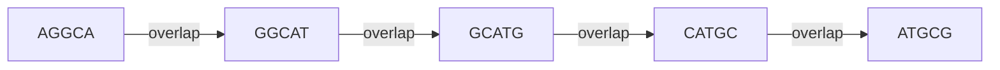
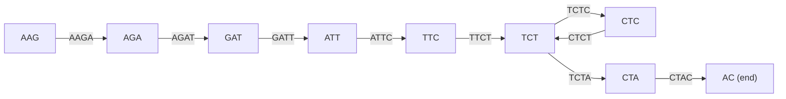
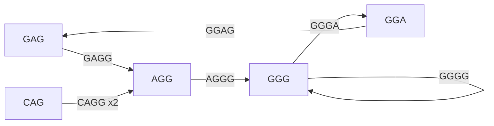
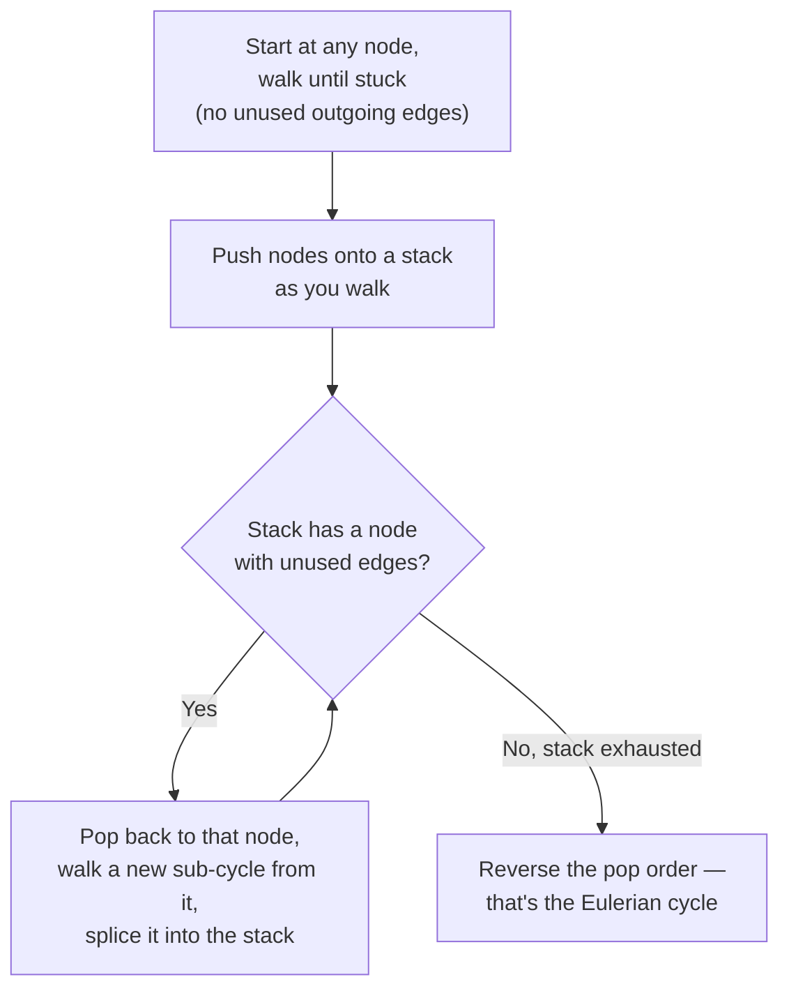

# 🧬 Bioinformatics Algorithms — Courses 1 & 2

**Finding Hidden Messages in DNA + Genome Sequencing**

A hands-on Python implementation of the core algorithms from the first two courses of the *Bioinformatics Specialization*: pattern counting, frequent k-mer discovery, reverse complements, clump finding, GC skew analysis, approximate (mismatch-tolerant) pattern matching, and regulatory-motif discovery (brute-force, greedy, randomized, Gibbs sampling) from **Course 1**, plus genome assembly via k-mer composition, overlap graphs, De Bruijn graphs, and Eulerian-path traversal from **Course 2**.

---

## 📖 Overview

This repository contains my coursework implementations for **Course 1 — "Finding Hidden Messages in DNA" (Chapters 1–2: replication origins and regulatory motifs)**, plus an early start on **Course 2 — "Genome Sequencing"**, which reframes assembly as a graph problem.

Chapter 1 of Course 1 builds up, algorithm by algorithm, to a real biological question: *where does the origin of replication (`oriC`) hide in a bacterial genome?* Each script tackles one piece of that puzzle, starting from brute-force string searches and evolving into efficient, dictionary-based algorithms capable of scanning full genomes (including a **4.5 Mb *E. coli*** chromosome) in a fraction of a second. It goes past exact-match searching into **approximate pattern matching with mismatches**, **GC skew analysis**, and finally combines all of it into `dna_finder.py` — an end-to-end pipeline that locates the likely `oriC` region and candidate DnaA boxes directly from a raw genome file.

Chapter 2 of Course 1 shifts from replication origins to **regulatory motif discovery**: finding a shared, weakly-conserved pattern across a *set* of DNA strings (rather than within one genome). It covers Brute-Force Motif Enumeration, the Median String problem, Profile-most Probable k-mer, Greedy Motif Search (with and without Laplace pseudocounts), Randomized Motif Search, and Gibbs Sampling — plus a motif-logo plotting utility built on `logomaker`.

The repo also has an early foothold in **Course 2: "Genome Sequencing (Bioinformatics II)"**, which reframes fragment assembly as a graph-theory problem — k-mer composition, genome-path reconstruction, overlap graphs, and De Bruijn graph construction (both from a string and from a k-mer collection), along with a general Eulerian-cycle solver via Hierholzer's algorithm. Every file includes worked examples and standalone test cases so the logic can be verified independently of the course's own grader.

## 🎓 Course Information

|                          |                                                                                                                  |
| ------------------------ | ---------------------------------------------------------------------------------------------------------------- |
| **Specialization** | [Bioinformatics Specialization](https://www.coursera.org/specializations/bioinformatics)                          |
| **Courses**        | Course 1 — Finding Hidden Messages in DNA (Bioinformatics I); Course 2 — Genome Sequencing (Bioinformatics II) |
| **University**     | University of California, San Diego (UCSD)                                                                       |
| **Platform**       | Coursera                                                                                                         |
| **Instructors**    | Pavel Pevzner, Phillip Compeau                                                                                   |

## 🧩 Topics Covered

### Chapter 1 — Replication Origin

| Algorithm                                                     | File                                                         | Description                                                                                                                               |
| ------------------------------------------------------------- | ------------------------------------------------------------ | ----------------------------------------------------------------------------------------------------------------------------------------- |
| **Pattern Count**                                       | `PatternCount_Chapter_1_Task1.py`                          | Brute-force count of how many times a pattern occurs (with overlaps) in a text                                                            |
| **Frequent Words (naive)**                              | `Frequent_words.py`                                        | Finds the most frequent*k*-mers in a string by counting every substring against every other                                             |
| **Frequency Table / Better Frequent Words**             | `Frequent_words_efficient.py`                              | Builds a hash-map frequency table in one pass, then extracts the max-count*k*-mers                                                      |
| **Reverse Complement**                                  | `Reverse_compliment.py`                                    | Reverses a DNA strand and swaps each base for its Watson–Crick complement (A↔T, C↔G)                                                   |
| **Pattern Matching**                                    | `pattern_matching.py`                                      | Returns every starting position of a pattern in a genome, including a FASTA-aware file reader                                             |
| **Clump Finding (naive)**                               | `Find_Clumps.py`                                           | Slides an L-length window across the genome and flags*k*-mers appearing ≥ *t* times inside it                                        |
| **Clump Finding (efficient)**                           | `Find_Clumps_Efficient.py`                                 | Pre-indexes every*k*-mer's positions once, then checks clump membership in a single pass — fast enough for the full *E. coli* genome |
| **GC Skew / Minimum Skew**                              | `Skew_Count.py`                                            | Tracks the running G−C count across a genome and returns the position(s) of minimum skew                                                 |
| **Hamming Distance / Approximate Pattern Matching**     | `Hamming_Distance.py`                                      | Counts mismatched positions between equal-length strings, then finds every position where a pattern occurs with ≤*d* mismatches        |
| **d-Neighborhood Generation**                           | `Immediate_neighbor.py`                                    | Recursively generates every*k*-mer within Hamming distance *d* of a given pattern                                                     |
| **Frequent Words with Mismatches**                      | `Freequent_words_with_mismatches.py`                       | Extends Better Frequent Words to tolerate up to*d* mismatches per occurrence                                                            |
| **Frequent Words with Mismatches + Reverse Complement** | `Frequent_Words_with_mismatches_and_reverse_complement.py` | Also counts each k-mer's reverse-complement neighborhood — the exact motif definition of a biological DnaA box                           |
| **DnaA Box / oriC Finder Pipeline**                     | `dna_finder.py`                                            | End-to-end pipeline: skew → windowed motif search → position mapping → skew plot + JSON report                                         |

### Chapter 2 — Regulatory Motifs

| Algorithm                                      | File                                        | Description                                                                                                                                                                                     |
| ---------------------------------------------- | ------------------------------------------- | ----------------------------------------------------------------------------------------------------------------------------------------------------------------------------------------------- |
| **Motif Enumeration (Brute-Force)**      | `motif_enumeration.py`                    | Finds all (k, d)-motifs shared across every string in a DNA collection, via neighborhood generation + membership testing                                                                        |
| **Distance Between Pattern and Strings** | `distance_between_pattern_and_strings.py` | Computes`d(Pattern, Dna)`, the sum of minimum Hamming distances from a pattern to each DNA string — the scoring function behind Median String                                                |
| **Median String**                        | `median_string.py`                        | Exhaustively searches all*k*-mers to find the one minimizing total distance to a DNA collection                                                                                               |
| **Improved Median String**               | `Improved_Median_Strings.py`              | Same problem, refactored to reuse`distance_between_pattern_and_strings` with a fallback implementation baked in                                                                               |
| **Profile-most Probable k-mer**          | `profile_most_probable_k_mer.py`          | Given a 4×k profile matrix, finds the*k*-mer in a string with the highest profile probability                                                                                                |
| **Motif Profile / Scoring Utilities**    | `motif_profile.py`                        | Builds count/profile matrices as pandas DataFrames and computes per-column Shannon entropy                                                                                                      |
| **Greedy Motif Search**                  | `greedy_motif_search.py`                  | Builds motifs one DNA string at a time, always picking the profile-most-probable k-mer from the motifs seen so far                                                                              |
| **Greedy Motif Search + Pseudocounts**   | `Improved_Greedy_Motif_Search.py`         | Same greedy strategy, but uses Laplace's Rule of Succession (pseudocounts) to avoid zero-probability profile columns                                                                            |
| **Randomized Motif Search**              | `RandomizedMotifSearch.py`                | Randomly seeds a motif set, then iteratively re-derives the profile and re-samples motifs until the score stops improving; typically run with many random restarts                              |
| **Gibbs Sampling**                       | `GibbsSampler.py`                         | Randomized local search that resamples one motif at a time (rather than all of them) using a profile built from the rest — escapes local optima that greedy/randomized search can get stuck in |
| **Motif Logo Plotting**                  | `plot_motif_logo.py`                      | Converts a motif profile into an information-content matrix and renders a sequence logo with`logomaker`                                                                                       |

### Course 2 — Genome Sequencing / Genome Assembly (in progress)

| Algorithm                                                    | File                           | Description                                                                                                                           |
| ------------------------------------------------------------ | ------------------------------ | ------------------------------------------------------------------------------------------------------------------------------------- |
| **k-mer Composition**                                  | `string_composition_kmer.py` | Slides a window of length*k* across a string to produce its full k-mer composition                                                  |
| **Genome Path → String**                              | `genome_path_string.py`      | Reconstructs a genome string from an ordered path of overlapping k-mers                                                               |
| **Overlap Graph**                                      | `overlap_graph.py`           | Builds the overlap graph of a k-mer collection: an edge`u → v` exists when `Suffix(u) == Prefix(v)`                              |
| **De Bruijn Graph (from a string)**                    | `debrujin_graph_builder.py`  | Constructs`DeBruijn_k(Text)`: nodes are (k−1)-mers, edges are the k-mers of `Text`, glued together at shared (k−1)-mer overlaps |
| **De Bruijn Graph (from k-mers)**                      | `debrujin_from_kmers.py`     | Same construction, but starting from an unordered k-mer collection instead of a single string                                         |
| **De Bruijn Graph (binary, generic) + Eulerian Cycle** | `debrujin_graph.py`          | Builds the De Bruijn graph over binary k-mers and finds an Eulerian cycle through it using Hierholzer's algorithm                     |

## 🗺️ Graph Concepts, Visualized

The genome-assembly scripts revolve around three closely related graph structures. All three answer the same underlying question — *"how do these fragments overlap?"* — but they build the graph out of different pieces.

### Overlap Graph

Each **k-mer is a node**. A directed edge `u → v` is drawn when the last *k*−1 characters of `u` match the first *k*−1 characters of `v`. Below is the actual graph produced by `overlap_graph.py` for the patterns `ATGCG, GCATG, CATGC, AGGCA, GGCAT`:



This chains the k-mers into the reconstructed string `AGGCATGCG` — exactly what `genome_path_string.py` does once the path through the graph is known.

### De Bruijn Graph (from a string)

Instead of making each k-mer a node, a De Bruijn graph makes each **(k−1)-mer a node**, and each k-mer becomes a directed **edge** from its prefix to its suffix. Nodes that appear more than once (i.e., repeated (k−1)-mers) are automatically glued together — this is what lets De Bruijn graphs represent repeats compactly, unlike overlap graphs. Below is the graph `debrujin_graph_builder.py` builds for `Text = "AAGATTCTCTAC"`, `k = 4`:



Notice `TCT` appears twice as a source — once feeding into `CTA` and once (via the edge from `CTC`) creating a small cycle. That's the graph capturing the repeated substring `TCT` occurring twice in the text.

### De Bruijn Graph (from an unordered k-mer collection)

`debrujin_from_kmers.py` builds the same style of graph, but starting from a k-mer *collection* rather than a contiguous string — this is the realistic assembly scenario, where a sequencer gives you a bag of overlapping reads with no known order. For k-mers `GAGG, CAGG, GGGG, GGGA, CAGG, AGGG, GGAG` (note `CAGG` appears twice):



Following any Eulerian path through this graph (a path that uses every edge exactly once) reconstructs a genome consistent with all seven k-mers — this is the core idea behind De Bruijn-graph genome assemblers like Velvet and SPAdes.

### Eulerian Cycle via Hierholzer's Algorithm

`debrujin_graph.py` builds a De Bruijn graph over binary k-mers (a compact way to sanity-check assembly logic without real DNA) and finds an **Eulerian cycle** — a closed walk that traverses every edge exactly once — using Hierholzer's algorithm. The high-level idea:



This is the same graph-theoretic machinery underlying real short-read genome assemblers: reads become k-mer edges in a De Bruijn graph, and an Eulerian (or, more realistically, Eulerian-*path*-seeking) traversal reconstructs the assembled sequence.

## 🌳 File Structure

```
Bioinformatics_Algorithms_Codebase-master/
├── Chapter 1 — Replication Origin
│   ├── PatternCount_Chapter_1_Task1.py        # Core pattern_count() + file-based test runner
│   ├── Frequent_words.py                      # Naive FrequentWords algorithm
│   ├── Frequent_words_efficient.py            # FrequencyTable + BetterFrequentWords
│   ├── Reverse_compliment.py                  # reverse_complement()
│   ├── pattern_matching.py                    # pattern_matching() + FASTA file search
│   ├── Find_Clumps.py                         # Naive (L, t)-clump finder
│   ├── Find_Clumps_Efficient.py               # Optimized clump finder (genome-scale)
│   ├── Skew_Count.py                          # calculate_skew() + minimum_skew()
│   ├── Hamming_Distance.py                    # hamming_distance() + approximate_pattern_matching()
│   ├── Immediate_neighbor.py                  # neighbors() — d-neighborhood generator
│   ├── Freequent_words_with_mismatches.py     # approximate_pattern_count() + mismatch-tolerant frequent words
│   ├── Frequent_Words_with_mismatches_and_reverse_complement.py  # + reverse-complement-aware variant
│   └── dna_finder.py                          # Full oriC/DnaA-box pipeline (skew + motif search + plotting)
│
├── Chapter 2 — Regulatory Motifs
│   ├── motif_enumeration.py                   # Brute-force (k, d)-motif search
│   ├── distance_between_pattern_and_strings.py # d(Pattern, Dna) scoring function
│   ├── median_string.py                       # Exhaustive Median String search
│   ├── Improved_Median_Strings.py             # Refactored Median String
│   ├── profile_most_probable_k_mer.py         # Profile-most-probable k-mer
│   ├── motif_profile.py                       # Count/profile matrices + column entropy (pandas)
│   ├── greedy_motif_search.py                 # Greedy Motif Search
│   ├── Improved_Greedy_Motif_Search.py        # Greedy Motif Search with Laplace pseudocounts
│   ├── RandomizedMotifSearch.py                # Randomized Motif Search (with random restarts)
│   ├── GibbsSampler.py                        # Gibbs Sampling motif search
│   └── plot_motif_logo.py                     # Sequence-logo plotting (logomaker)
│
├── Course 2 — Genome Sequencing / Genome Assembly (in progress)
│   ├── string_composition_kmer.py             # kmer_composition()
│   ├── genome_path_string.py                  # genome_path_to_string()
│   ├── overlap_graph.py                       # overlap_graph()
│   ├── debrujin_graph_builder.py              # de_bruijn_from_string()
│   ├── debrujin_from_kmers.py                 # de_bruijn_from_kmers()
│   └── debrujin_graph.py                      # Binary De Bruijn graph + Hierholzer's Eulerian cycle
│
├── E_coli.txt                             # Full E. coli genome (input data)
├── Vibrio_cholerae.txt                    # Full V. cholerae genome (input data)
├── Salmonella_enterica.txt                # Full S. enterica genome (input data, used by dna_finder.py)
├── DosR.txt                                # DosR gene upstream regions (Ch.2/M. tuberculosis motif dataset)
├── dataset_30278_*.txt, dataset_303*.txt, dataset_*.txt  # Course grader datasets (per-algorithm inputs)
├── output_positions_vibrio_cholerae*.txt  # Saved pattern-matching results
├── dnaa_results.json                      # Saved output of dna_finder.py (DnaA box candidates + positions)
├── gc_skew_plot.png                       # Saved GC-skew diagram generated by dna_finder.py
│
├── PatternCount_Chapter_1_Task1.pyproj    # Visual Studio Python project file
├── PatternCount_Chapter_1_Task1.slnx      # Visual Studio solution file
├── .gitattributes
├── .gitignore
└── README.md
```

## 🛠️ Technologies Used

- **Python 3** — mostly standard library (`os`, `sys`, `time`, `json`, `random`, `itertools`, `collections.defaultdict`)
- **pandas** — used by `motif_profile.py` for count/profile matrices (`pip install pandas`)
- **Matplotlib** — used by `dna_finder.py` and `plot_motif_logo.py` to render and save plots (`pip install matplotlib`)
- **logomaker** — used by `plot_motif_logo.py` to render sequence logos (`pip install logomaker`)
- **Visual Studio** — project developed and managed via `.pyproj` / `.slnx` files (Python workload)
- **Git** — version control

## ⚙️ Setup Instructions

**1. Clone the repository**

```bash
git clone https://github.com/<your-username>/Bioinformatics_Algorithms_Codebase.git
cd Bioinformatics_Algorithms_Codebase
```

**2. Requirements**

Python 3 for everything; a few scripts need extra packages:

```bash
python3 --version
pip install matplotlib pandas logomaker   # only needed for dna_finder.py, motif_profile.py, plot_motif_logo.py
```

**3. Run any script**

Most scripts include a `__main__` block with built-in test cases, so they can simply be run directly:

```bash
# Chapter 1
python3 Reverse_compliment.py
python3 pattern_matching.py
python3 Frequent_words_efficient.py
python3 Find_Clumps.py
python3 Find_Clumps_Efficient.py
python3 Skew_Count.py
python3 Hamming_Distance.py
python3 Immediate_neighbor.py
python3 Freequent_words_with_mismatches.py
python3 Frequent_Words_with_mismatches_and_reverse_complement.py

# Full oriC / DnaA-box finder pipeline (needs matplotlib):
pip install matplotlib
python3 dna_finder.py

# Chapter 2
python3 motif_enumeration.py
python3 median_string.py
python3 greedy_motif_search.py
python3 Improved_Greedy_Motif_Search.py
python3 RandomizedMotifSearch.py
python3 GibbsSampler.py

# Course 2 (Genome Assembly)
python3 string_composition_kmer.py
python3 genome_path_string.py
python3 overlap_graph.py
python3 debrujin_graph_builder.py
python3 debrujin_from_kmers.py
python3 debrujin_graph.py
```

> ⚠️ **Note on file paths:** `PatternCount_Chapter_1_Task1.py` and `Find_Clumps_Efficient.py` currently read input files from a hardcoded Windows path (`base_dir = r"C:\Users\ZAID BILAL\..."`). Update `base_dir` to your local repo path (or switch to a relative path like `os.path.dirname(__file__)`) before running these two on another machine.

**4. Import functions into your own scripts**

```python
from Reverse_compliment import reverse_complement
from Frequent_words_efficient import FrequencyTable, BetterFrequentWords
from pattern_matching import pattern_matching, pattern_matching_from_file
from Find_Clumps_Efficient import FindClumpsFast
from Skew_Count import calculate_skew, minimum_skew
from Hamming_Distance import hamming_distance, approximate_pattern_matching
from Immediate_neighbor import neighbors
from Frequent_Words_with_mismatches_and_reverse_complement import frequent_words_with_mismatches_and_rc
from dna_finder import find_dna_a_box

from motif_enumeration import motif_enumeration
from greedy_motif_search import score_motifs
from Improved_Greedy_Motif_Search import create_profile_with_pseudocounts
from RandomizedMotifSearch import *
from GibbsSampler import *

from string_composition_kmer import kmer_composition
from genome_path_string import genome_path_to_string
from overlap_graph import overlap_graph
from debrujin_graph_builder import de_bruijn_from_string
from debrujin_from_kmers import de_bruijn_from_kmers

print(reverse_complement("AAAACCCGGT"))
# → ACCGGGTTTT

# Run the full oriC pipeline on any genome file:
results = find_dna_a_box("Salmonella_enterica.txt", k=9, d=1, window_size=500)

# Build a De Bruijn graph from a k-mer collection:
graph = de_bruijn_from_kmers(["GAGG", "CAGG", "GGGG", "GGGA", "CAGG", "AGGG", "GGAG"])
```

## ✅ Progress Tracker

| Week               | Topic                                                                              | Status                                                     |
| ------------------ | ---------------------------------------------------------------------------------- | ---------------------------------------------------------- |
| Week 1             | Pattern Count                                                                      | ✅ Complete                                                |
| Week 1             | Frequent Words (naive)                                                             | ✅ Complete                                                |
| Week 1             | Frequency Table / Better Frequent Words                                            | ✅ Complete                                                |
| Week 1             | Reverse Complement                                                                 | ✅ Complete                                                |
| Week 1             | Pattern Matching (incl. genome file search)                                        | ✅ Complete                                                |
| Week 1             | Clump Finding (naive)                                                              | ✅ Complete                                                |
| Week 1             | Clump Finding (efficient, genome-scale)                                            | ✅ Complete                                                |
| Week 2             | Skew Diagrams / Minimum Skew                                                       | ✅ Complete                                                |
| Week 2             | Hamming Distance / Approximate Pattern Matching                                    | ✅ Complete                                                |
| Week 2             | d-Neighborhood Generation                                                          | ✅ Complete                                                |
| Week 2             | Frequent Words with Mismatches (+ Reverse Complement)                              | ✅ Complete                                                |
| Week 2             | DnaA Box / oriC Finder Pipeline (skew + motif search + plotting)                   | ✅ Complete — tested end-to-end on*Salmonella enterica* |
| Week 3             | Motif Enumeration (Brute-Force Motif Search)                                       | ✅ Complete                                                |
| Week 3             | Median String / Profile-most Probable k-mer                                        | ✅ Complete                                                |
| Week 3             | Greedy Motif Search (with Laplace/pseudocount smoothing)                           | ✅ Complete                                                |
| Week 3             | Motif Logo Plotting                                                                | ✅ Complete                                                |
| Week 4             | Randomized Motif Search                                                            | ✅ Complete                                                |
| Week 4             | Gibbs Sampling                                                                     | ✅ Complete                                                |
| Week 5             | Bioinformatics Application Challenge (real motif dataset,*M. tuberculosis*/DosR) | ✅ Complete                                                |
| **Course 2** | Genome Assembly — k-mer Composition, Genome Path, Overlap Graph                   | ✅ Complete                                                |
| **Course 2** | Genome Assembly — De Bruijn Graph (from string / from k-mers)                     | ✅ Complete                                                |
| **Course 2** | Eulerian Cycle (Hierholzer's Algorithm)                                            | ✅ Complete                                                |
| **Course 2** | Eulerian Path (for non-cyclic assembly) / String Reconstruction from Read-Pairs    | ⬜ Not started                                             |
| **Course 2** | De Bruijn Assembly with Real Sequencing Reads / Contig Generation                  | ⬜ Not started                                             |

## 💻 Sample Outputs

**Pattern Count**

```python
pattern_count("ATGCATTCATCG", "TC")
# → 2
```

**Reverse Complement**

```python
reverse_complement("AAAACCCGGT")
# → "ACCGGGTTTT"
```

**Better Frequent Words**

```python
BetterFrequentWords("ACGTTGCATGTCGCATGATGCATGAGAGCT", 4)
# → "GCAT CATG"
```

**Pattern Matching**

```python
pattern_matching("GATATATGCATATACTT", "ATAT")
# → [1, 3, 9]
```

**Genome-Scale Pattern Matching** (searching *Vibrio cholerae* for the `oriC`-associated 9-mer `CTTGATCAT`)

```python
pattern_matching_from_file("Vibrio_cholerae.txt", "CTTGATCAT")
# → [116556, 149355, 151913, 152013, 152394, 186189, 194276,
#    200076, 224527, 307692, 479770, 610980, 653338, 679985,
#    768828, 878903, 985368]
```

Notice how several matches cluster tightly around position ~152,000 — exactly the kind of clump that points to a replication origin.

**Efficient Clump Finding on the full *E. coli* genome** (*k*=9, L=500, t=3)

```
Number of distinct k-mers forming (L, t)-clumps in E. coli genome: 1904
Time taken to find clumps: <1 second
```

**Minimum Skew**

```python
minimum_skew("GAGCCACCGCGATA")
# → [9, 10, 11, 12]
```

**Approximate Pattern Matching (Hamming distance ≤ d)**

```python
approximate_pattern_matching("CGCCCGAATCCAGAACGCATTCCCATGTACA", "ATTCTGGA", 3)
# → positions where "ATTCTGGA" occurs with at most 3 mismatches
```

**d-Neighborhood Generation**

```python
neighbors("GGGGGGCGT", 2)
# → set of every 9-mer within Hamming distance 2 of "GGGGGGCGT"
```

**Frequent Words with Mismatches + Reverse Complement**

```python
frequent_words_with_mismatches_and_rc("ACGTTGCATGTCGCATGATGCATGAGAGCT", 4, 1)
# → most frequent 4-mers counting both a k-mer's mismatch-neighborhood
#   and its reverse complement's — the actual definition of a DnaA box motif
```

**DnaA Box / oriC Finder Pipeline** (*Salmonella enterica*, *k*=9, *d*=1, window=500)

```
Genome Length: 4,809,037 bp
Estimated oriC Center: 3,764,856
Window Analyzed: 3,764,606 to 3,765,106
Candidate DnaA Boxes: ['CCGGAAGCT', 'AGCTTCCGG']
  > Motif 'CCGGAAGCT': [3764688, 3764693, 3764747, 3764998, 3765003]
  > Motif 'AGCTTCCGG': [3764688, 3764693, 3764747, 3764998, 3765003]
```

Note that `AGCTTCCGG` is the reverse complement of `CCGGAAGCT` — both mapping to the exact same five genome positions confirms the pipeline is correctly picking up a real palindromic-ish DnaA box cluster right at the minimum-skew point. Results are saved to `dnaa_results.json`, and the full genome-wide skew curve (with the oriC window highlighted) is saved to `gc_skew_plot.png`.

**k-mer Composition**

```python
kmer_composition("CAATCCAAC", 5)
# → ['CAATC', 'AATCC', 'ATCCA', 'TCCAA', 'CCAAC']
```

**Overlap Graph**

```python
overlap_graph(["ATGCG", "GCATG", "CATGC", "AGGCA", "GGCAT"])
# → {'AGGCA': ['GGCAT'], 'CATGC': ['ATGCG'],
#    'GCATG': ['CATGC'], 'GGCAT': ['GCATG']}
```

**De Bruijn Graph (from a string)**

```python
de_bruijn_from_string("AAGATTCTCTAC", 4)
# → {'AAG': ['AGA'], 'AGA': ['GAT'], 'GAT': ['ATT'], 'ATT': ['TTC'],
#    'TTC': ['TCT'], 'TCT': ['CTA', 'CTC'], 'CTC': ['TCT']}
```

**De Bruijn Graph (from a k-mer collection)**

```python
de_bruijn_from_kmers(["GAGG", "CAGG", "GGGG", "GGGA", "CAGG", "AGGG", "GGAG"])
# → {'AGG': ['GGG'], 'CAG': ['AGG', 'AGG'], 'GAG': ['AGG'],
#    'GGA': ['GAG'], 'GGG': ['GGA', 'GGG']}
```

See [Graph Concepts, Visualized](#️-graph-concepts-visualized) above for diagrams of each of these.

## 🔭 Next Steps

Having finished Course 1 in full (Weeks 1–4: pattern warm-up → skew analysis → mismatch-tolerant motif search → `oriC`/DnaA-box pipeline → brute-force, greedy, randomized, and Gibbs-sampling motif finders) and made a start on **Course 2 — "Genome Sequencing" (How Do We Assemble Genomes?)**, the natural continuation is to finish genome assembly:

- **Eulerian Path** (rather than Eulerian *Cycle*) for reconstructing genomes from De Bruijn graphs that aren't perfectly balanced — the realistic case for real sequencing data.
- **String Reconstruction from Read-Pairs**, which uses paired k-mers with a known gap distance to resolve repeats that a single De Bruijn graph can't disambiguate.
- **Contig Generation** from a De Bruijn graph — extracting maximal non-branching paths when a full Eulerian path isn't possible due to gaps or errors in the reads.
- **Week 5 — Bioinformatics Application Challenge:** finishing the motif-finding pass on the `DosR.txt` dataset — genes thought to help *Mycobacterium tuberculosis* enter dormancy in a host.

Planned repo additions to match: `Eulerian_Path.py`, `String_Reconstruction_Read_Pairs.py`, and `Contig_Generation.py`, each following the same pattern used throughout this repo — a pure algorithm function, a file-based test runner, and inline worked examples.

## 👤 Author

**Muhammad Zaid Bilal**
Computer Science, IBA Karachi

## 🙏 Acknowledgments

- **Coursera** and **UC San Diego (UCSD)** for the *Bioinformatics Specialization*
- **Dr. Pavel Pevzner** and **Dr. Phillip Compeau** for the course content and the accompanying textbook *Bioinformatics Algorithms: An Active Learning Approach*
- The **Rosalind**-style genome datasets (*E. coli*, *Vibrio cholerae*, *Salmonella enterica*) used throughout for real-world testing

## 📄 License

This project is private coursework and is **not licensed for reuse or redistribution**. All rights reserved. You may contact the author if you wish to reuse this repository.
